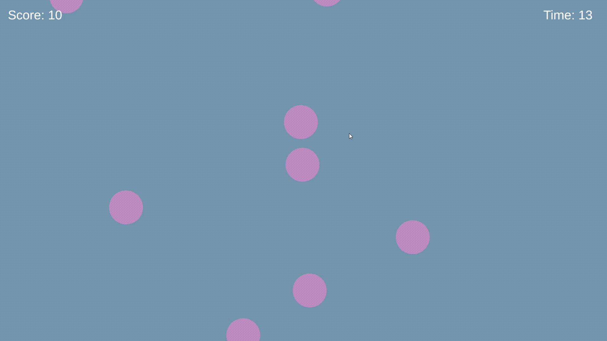

# 🫧 Bubble Pop: 2D Mobile Arcade Game

<div align="center">
  
  <p><strong>A fast-paced, physics-driven bubble-popping arcade experience</strong></p>
</div>

**Bubble Pop** is a fast-paced physics-based 2D mobile game built in Unity. The design focuses on immediate, addictive gameplay: the game begins instantly upon launching the app, challenging players to score as high as possible within a countdown timer. With smooth animations, satisfying audio feedback, and responsive controls, Bubble Pop delivers a classic arcade experience optimized for mobile devices.

This project demonstrates advanced Unity development skills, including **RigidBody2D physics**, **automatic spawning systems**, **animator integration**, **sound management**, and **scene management** for game loops.

-----

## 📺 Gameplay Demo

### 🎬 Demo GIF


> **Quick Look:** Watch the smooth floating animation utilizing `Time.deltaTime`, automatic spawning of bubbles at intervals, satisfying pop animations with audio feedback, and responsive physics-based movement. The gameplay is designed to keep players engaged with increasing bubble spawns as they progress.

-----

## 🚀 Key Features & Technical Implementation

### 1\. Game Flow & Interaction

  * **Instant Start:** Designed for quick sessions, the game logic and spawner initialize immediately when the application (APK) is opened. No menus or loading screens—jump straight into action.
  * **Touch Interaction:** Implemented input detection using Unity's `OnMouseDown()` callback to allow players to "pop" bubbles by tapping them. Each pop triggers animation, sound effects, and score updates.
  * **Restart Loop:** Once the timer expires, the **Game Over** UI appears with final score display, providing a simple "Restart" button to reload the scene and try again immediately for infinite replayability.

### 2\. Physics & Movement

  * **Dynamic Floating System:** Bubbles utilize a custom movement script using `Time.deltaTime` to ensure smooth, frame-rate independent floating that works consistently across all devices regardless of refresh rate. Bubbles drift upward with slight lateral movement for visual interest.
  * **Unity Physics Engine:** Utilizes **CircleCollider2D** and **Rigidbody2D** components to handle collision detection and physics-based movement. Colliders enable proper touch detection and prevent visual overlap.

### 3\. Core Systems

  * **Automatic Spawner:** A dedicated spawner script (`BubbleSpawner.cs`) instantiates bubble prefabs at configurable random intervals along the bottom of the screen. Spawning rate can be tuned for difficulty scaling.
  * **Scoring & Timer:**
      * **Score System:** Updates dynamically on the UI whenever a bubble is successfully popped. Each bubble awards 10 points, displayed in real-time via the `GameManager`.
      * **Countdown Timer:** A precise countdown system starts at game launch and triggers the Game Over state when it reaches zero, displaying final score for player feedback.
  * **Audio & Animation:** Includes polished sound effects for bubble pops and smooth scale/fade animations to enhance the game feel. The animator is enabled when bubbles are popped to trigger pop animations before destruction.

-----

## 📂 Project Structure

The project is organized to keep logic and assets clean:

```
📦 Assets
 ┣ 📂 Audio
 ┃ ┗ 🔊 pop_sound.wav              (Bubble pop sound effect)
 ┣ 📂 Prefabs
 ┃ ┗ 🫧 Bubble.prefab               (Reusable bubble prefab)
 ┣ 📂 Scenes
 ┃ ┗ 🎮 GameplayScene.unity         (Main gameplay scene)
 ┣ 📂 Scripts
 ┃ ┣ 📄 BubblePopper.cs             (Bubble interaction logic)
 ┃ ┣ 📄 BubbleMovement.cs           (Floating movement logic)
 ┃ ┣ 📄 BubbleSpawner.cs            (Automatic spawning system)
 ┃ ┗ 📄 GameManager.cs              (Game state & scoring)
 ┗ 📂 Sprites
 ┃ ┣ 🎨 bubble_blue.png             (Bubble sprite asset)
 ┃ ┗ 🎨 UI_elements.png             (UI assets)
```

### 📝 Key Script Paths & Functions

| Script | Path | Purpose |
|--------|------|---------|
| **BubblePopper** | `Assets/Scripts/BubblePopper.cs` | Handles bubble click detection and pop animation |
| **BubbleMovement** | `Assets/Scripts/BubbleMovement.cs` | Manages floating animation with `Time.deltaTime` |
| **BubbleSpawner** | `Assets/Scripts/BubbleSpawner.cs` | Instantiates bubbles at random intervals |
| **GameManager** | `Assets/Scripts/GameManager.cs` | Controls score, timer, and game state |

-----

## 📸 Screenshots

| Active Gameplay | Game Over Screen |
| :---: | :---: |
|  |  |
| *Bubbles floating up the screen with score and timer visible* | *Final score display with Restart button for immediate replay* |

-----

## 🛠️ How to Run

### Option 1: Run in Unity Editor (Recommended for Development)
```bash
# 1. Clone the Repository
git clone https://github.com/DDev333/Bubble_Pop.git
cd Bubble_Pop

# 2. Open in Unity Hub
# - Launch Unity Hub
# - Click "Add project from disk"
# - Select the Bubble_Pop folder

# 3. Open Scene & Play
# - Navigate to Assets/Scenes/GameplayScene.unity
# - Double-click to open the scene
# - Press Play (▶) in the top toolbar
# - Click bubbles to test the gameplay
```

**Minimum Requirements:**
- Unity 2020.3 LTS or later
- .NET Framework 4.7.1+
- 2GB free disk space

### Option 2: Build for Android (Mobile Deployment)
```bash
# 1. Install Android SDK
# Download Android SDK via Unity Hub or Android Studio

# 2. Open Build Settings
# File → Build Settings

# 3. Select Android Platform
# - Click "Android" in the platform list
# - Click "Switch Platform"
# - Wait for compilation to complete

# 4. Configure Player Settings
# - Set Company Name and Product Name
# - Adjust screen orientation (Portrait recommended)
# - Set target API level (API 30 or higher)

# 5. Build APK
# - Click "Build and Run"
# - Select a connected Android device or emulator
# - Wait for APK to build and install
```

**Android Requirements:**
- Android 7.0 (API Level 24) or higher
- ARM64 architecture support

-----

## 🎮 Controls & Gameplay

| Action | Control | Notes |
|--------|---------|-------|
| **Pop Bubble** | Tap/Click on bubble | Each pop awards 10 points and triggers animation + sound |
| **Restart Game** | Click "Restart" button after Game Over | Resets score and timer, instantly returns to gameplay |
| **N/A** | No pause functionality | Game runs continuously until timer reaches zero |

### Gameplay Tips
- **Speed Matters:** Bubbles spawn faster as the game progresses—stay focused!
- **Quick Reactions:** Each bubble is on screen for a limited time before floating off screen
- **Precision:** Click directly on the bubble sprite for reliable detection
- **Rhythm:** Develop a rhythm for rapid consecutive pops to build your score

-----

## 🔮 Future Improvements & Roadmap

### Phase 1: Core Features
  * [ ] **Main Menu Scene** - Add title screen with Start/Settings/Quit buttons for better game flow control.
  * [ ] **Settings Panel** - Audio volume control, difficulty selection, and visual quality options.
  * [ ] **Particle Effects** - Add satisfying particle bursts when bubbles pop for enhanced visual feedback.

### Phase 2: Game Enhancement
  * [ ] **High Score System** - Implement persistent local storage (PlayerPrefs) to save top scores between sessions.
  * [ ] **Difficulty Levels** - Easy/Medium/Hard modes with increasing spawn rates and timer durations.
  * [ ] **Combo Multiplier** - Track consecutive pops to unlock score multipliers (2x, 3x, etc.).

### Phase 3: Advanced Features
  * [ ] **Leaderboard Integration** - Cloud-based leaderboard using PlayFab or Firebase.
  * [ ] **In-Game Achievements** - Unlock badges for milestones (100 pops, 1000 points, etc.).
  * [ ] **Power-ups** - Temporary bonuses like slow-motion or score multipliers.
  * [ ] **Sound Designer Integration** - Music tracks and dynamic audio based on game state.

-----

## 📋 Development Notes

### Architecture Overview
The project follows a modular design pattern with separate concerns:
- **BubblePopper.cs** - Handles user input and bubble destruction logic
- **BubbleMovement.cs** - Manages physics-independent floating animation
- **BubbleSpawner.cs** - Controls bubble instantiation and spawn timing
- **GameManager.cs** - Orchestrates game state, scoring, and timer

### Recent Fixes & Improvements
- ✅ Fixed pop sound playback by delaying GameObject destruction until audio completes
- ✅ Enabled animator when bubble is popped to trigger pop animation sequences
- ✅ Set animator boolean flag instead of using triggers for more reliable animation control
- ✅ Improved destruction timing to allow animation completion before cleanup
- ✅ Added collider disable to prevent multiple rapid clicks on same bubble

### Known Issues & Workarounds
- **Audio Clipping:** If pop sounds overlap, consider using audio pools or fade-out effects
- **Frame Rate Dependency:** All animations use `Time.deltaTime` for consistency

### Testing Checklist
- [x] Bubble spawning works correctly at configurable intervals
- [x] Pop sound plays completely when bubble is clicked
- [x] Pop animation triggers reliably on bubble destruction
- [x] Score updates correctly (10 points per bubble)
- [x] Timer countdown works and triggers Game Over accurately
- [x] Game over state displays correctly with final score
- [x] Restart button successfully resets game state
- [x] Physics colliders prevent visual overlap
- [x] Works on devices with different screen sizes

-----

## 📚 Resources & Documentation

- **Unity Manual:** [Physics 2D Documentation](https://docs.unity3d.com/Manual/Physics2D.html)
- **Scripting API:** [Animator Documentation](https://docs.unity3d.com/ScriptReference/Animator.html)
- **Audio Guide:** [AudioSource Documentation](https://docs.unity3d.com/ScriptReference/AudioSource.html)
- **Project Setup:** See `Assets/Scripts/README.md` for detailed code documentation

-----

## 📞 Support & Contribution

Found a bug? Have a feature request? Feel free to:
- Open an issue on GitHub
- Submit a pull request with improvements
- Contact the developer directly

**Want to extend this project?** The modular design makes it easy to add:
- New bubble types with different properties
- Power-up systems
- Multiple game modes
- Custom themes and skins

-----

<div align="center">
  <p>
    <strong>Developed by Devesh Ghodpage</strong><br/>
    <em>Built with Unity & C#</em><br/>
    
  </p>
  <p>
    <a href="https://github.com/DDev333/Bubble_Pop">GitHub Repository</a> • 
    <a href="mailto:devesh@example.com">Contact</a>
  </p>
  <p>
    <em>Last Updated: December 2025</em>
  </p>
</div>